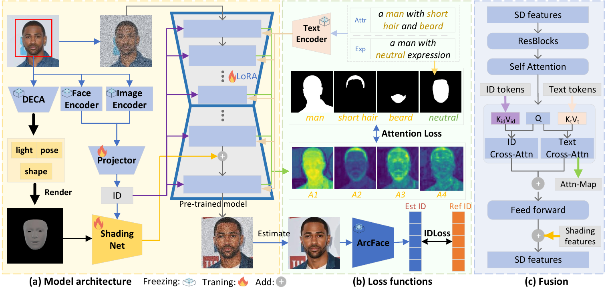

## Demo

<video controls autoplay src="https://github.com/user-attachments/assets/98bf0b4a-ac21-4eb7-bee1-ff85a5562796"></video>



Overview of our Face-MakeUpV2
## 🚀 Installation

1. Clone the repository:
```bash
git clone https://github.com/ddw2AIGROUP2CQUPT/Face-MakeUpV2.git
cd Face-MakeUpV2
```

2. Install dependencies:
```bash
pip install -r requirements.txt
```

3. Download pretrained models


### Web Demo
```bash
python demo/demo_v5/web_demo.py
```

### Training
```bash
bash train/mask/lora/train_v5.sh
```

## 📁 Project Structure

```
Face-MakeUpV2/
├── train/              # Training scripts
├── models/             # Model architectures
├── dataset/            # Dataset processing
├── utils/              # Utility functions
├── demo/               # Demo applications
└── examples/           # Usage examples
```

## 📄 License

This project is licensed under the MIT License - see the LICENSE file for details.

## Citation
```
@article{dai2025face,
  title={Face-MakeUpV2: Facial Consistency Learning for Controllable Text-to-Image Generation},
  author={Dai, Dawei and Zhou, Yinxiu and Li, Chenghang and Jiang, Guolai and Zhang, Chengfang},
  journal={arXiv preprint arXiv:2510.21775},
  year={2025}
}
```
